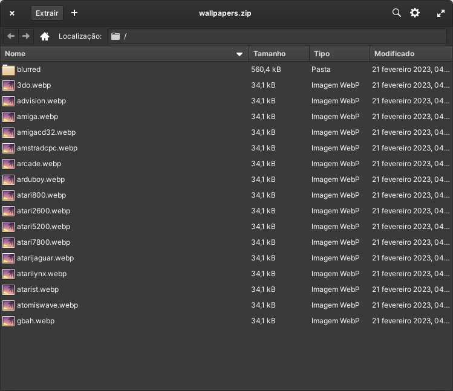

# About

Albedo Wallpaper Cropper (AWC) is an utility to load, crop, and save images. It's not an image editor like Photoshop or GIMP. Instead it's a tool to help collect and standardize custom backgrounds for [Albedo ES Theme](https://github.com/mluizvitor/es-theme-albedo).

You can load an image, position it on canvas, link it to a videogame console. Many images are accepted, but one at time. After saving an image, you can download one or all as zip.

Open [Albedo Wallpaper Cropper](https://albedo-wallpaper-cropper.vercel.app/)

- [About](#about)
- [Creating your own background step by step](#creating-your-own-background-step-by-step)
    - [1. Load an image](#1-load-an-image)
    - [2. Set image size](#2-set-image-size)
    - [3. Adding your image to the list](#3-adding-your-image-to-the-list)
    - [4. Downloading you images.](#4-downloading-you-images)
      - [Exporting single item](#exporting-single-item)
      - [Exporting all items](#exporting-all-items)
    - [5. Extracting to the right place](#5-extracting-to-the-right-place)
    - [Finishing](#finishing)


# Creating your own background step by step 

AWC is a simple app, but can be a bit confuse. This tutorial will cover the basic usage: load image, position, change resolution, link to a videogame console, download as zip, extract zip to the theme folder.

### 1. Load an image

On the left side of the screen there are 3 buttons and one text field. To load an image, tap the blue button labeled `Load Image`. Your browser will open a window to select an image. JPG, PNG and WEBP are accepted.

> Tip: You can paste an image from clipboard by tapping Ctrl+V (Windows/Linux) or Cmd+V (Mac). It's helpful if you want to load an image from a website. Still, some images are very large to load from clipboard, you can download and load normally as described above. 


<br>

After load, the image will be presented on the canvas in the middle of the screen.


<small>Screenshot from Pokémon Unbound by Skeli</small>

<br> 

### 2. Set image size

By default, the canvas will always load as `1920x1280`, this size is 4 times the RG351P/M resolution (`480x320`).

On the right side of the screen you can see a panel with text fields to manually change the canvas resolution and a preset menu sorted by aspect ratio. You can hover the `?` icon or buttons to see a tooltip. 


We'll continue our tutorial with the current settings.

As the image I loaded is an screenshot, I'll uncheck 'Smooth rendering' so the pixels will look sharp.


Smooth rendering is good if you are trying to use a photo or illustration.

Of course you noted that the canvas has dimmed parts. It's a visual clue to help you position your image. The area inside the square on center will appear on the theme carousel, and the dimmed parts on the sides will appear on Game List.

You can move your image for the better framing. By default the canvas anchor your image on the edges and will move only horizontally or vertically, but not both. If your image has portrait sizes (height greater than width) and your canvas has landscape sizes (width greater than height), some parts of your image ill be off canvas. Anchoring the image to move in just one direction help you move without the risk of getting an unwanted black border on tour image. 

### 3. Adding your image to the list

On the left side, click on the text field `Type to add a system`. I'll search for 'Game Boy Advance (Hacks)', as the screenshot I loaded is from a Pokémon hackrom.


The system list on AWC is the same used by AmberELEC, found on [es_systems.cfg](https://github.com/AmberELEC/AmberELEC/blob/dev/packages/ui/emulationstation/config/es_systems.cfg), plus auto collections. The search accepts a console full name (e.g. Game Boy Advance), the theme name (e.g. gba) and manufacturer name.
Start typing and click on desired option, I'll select `gbah`, then click on the yellow button labeled 'Add System'.


> If you're using Albedo ES Theme on a different system, you can enter a custom name if the entries present on list is not compatible. Batocera accept `gbc2players` as theme and rom directory for example.

<br>


The image will be added to a list o images sorted by the newest to the oldest added image. AWC will always save a normal and a blurred version of your image as you can see on the above screenshot. When you hover the image, your mouse pointer will change to a magnifying glass. You can zoom the added image to see the final result. 

<br>

***You can repeat the steps above if you want to add more images.***

<br>

|  |  |
| :------------------------------------------: | :--------------------------------------: |
|                  Pagination                  |                  Search                  |

I used the same image on new entries to show you the pagination and search features. Pagination is pretty simple. You can hover the buttons for more clues. Search added systems work the same way as search to add a system. You can use full names, theme name or manufacturer.

### 4. Downloading you images.

AWC can export one or all items. (Select specific items to export is not yet implemented, maybe never).


#### Exporting single item

To export a single item, click on the 3 dots button of the item card, them click `Export ***`. In this tutorial example: `Export gbah`.


A zip file will be downloaded containing the normal and blurred versions. 


#### Exporting all items

To export all items, click on Menu button, with the 3 bars. Then, click on `Download as ZIP`.


A zip file will be downloaded containing all the items and its blurred versions.



### 5. Extracting to the right place

Extract the files anywhere and move them to a folder called `customBackground` located on the root of the theme directory.

On the video below I show the process. I access my RG351M through SMB, entering its local IP and navigating to the AmberELEC theme folder:

```[device_location]/config/emulationstation/themes/```

Inside `es-theme-albedo` you can see some files and folders: `theme.xml`, `assets`, etc. The files must be placed inside `customBackground`.


After moving the images to the right place, you need to enable custom backgrounds. On your device press `Start` to open system menu > `UI Settings` > `Theme Set` change to `es-theme-albedo` > `Theme Configuration` > `Theme Background` change to `Custom`. Exit to apply changes.

The following pictures shows the changes from **Default** to **Custom** backgrounds, and the differences between choosing `normal` or `blurred` on **Game List Background** option

|  |  |
| :---------------------------------------: | :--------------------------------------: |
|       Default background for `gbah`       |       Custom background for `gbah`       |

|  |  |
| :---------------------------------------: | :--------------------------------------: |
|       Full image \| blurred version       |        Full image \| not blurred         |

As you can see, on carousel interface, just the center of the image is showed. As mentioned on step 2, the dimmed area of the canvas is supposed to appear only on game list.
